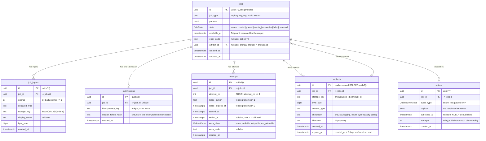

# Design — `audio-extract-vertical-slice`

**Answer first.** This design fixes *how* the first slice is put together: three processes
(Postgres 18, the NestJS API, the Python worker) plus Redis and a shared storage volume; a
Prisma-owned schema with a database-generated UUIDv7 as the single id source; the worker
writing Postgres directly through its own CAS statements (ADR-0003); a broker-agnostic
queue port with a raw Redis Streams adapter; and a container-per-worker sandbox whose
handler child runs in a network-less, non-root process. Every element below traces to a
requirement or an ADR; nothing is deferred work in disguise.

The authority chain is: the seven capability specs (60 requirements / 141 scenarios) >
ADR-0001 (storage) > ADR-0002 (queue) > ADR-0003 (database access, this change). Where a
proposal line is looser than a spec requirement, the spec wins and the correction is noted.

---

## 1. Decisions at a glance

| # | Decision | Where |
| --- | --- | --- |
| 1 | Data model: 6 entities; the **ERD in §3 is the authoritative reference**; the Prisma schema is written at scaffolding | §3, §4 |
| 2 | UUIDv7 via PostgreSQL 18 `uuidv7()`; `job_id` doubles as the capability id (no `public_id`) | §4 |
| 3 | Prisma owns migrations alone; worker read-only on schema | §5 |
| 4 | Worker writes Postgres directly (own CAS); API owns T1/T3/T5 | ADR-0003 |
| 5 | Queue port + Redis Streams adapter; XACK after commit; XAUTOCLAIM recovery | §6 |
| 6 | Vitest (API) + pytest (worker); no Playwright (no UI); compose E2E smoke | §11 |
| 7 | AV13: client-side storage of `job_id` + creator token; no listing endpoint | §12 |
| 8 | Process topology + monorepo layout | §2 |
| 9 | Secrets via env + redacting structured logs; lifecycle logging contract | §9 |
| 10 | Sandbox: container-per-worker, process-per-job, network-less handler child | §10 |
| 11 | redis-py verification spike | §13 |

---

## 2. Process topology and repository structure

### 2.1 Processes

| Process | Runtime | Container | Owns |
| --- | --- | --- | --- |
| PostgreSQL 18 | — | `mediaforge-postgres` (own volume `mediaforge-pgdata`, own DB `mediaforge`) | source of truth |
| Redis (7.x) | — | `mediaforge-redis` (own volume) | broker (Streams) |
| API | NestJS + TypeScript (Node) | `mediaforge-api` | C1, C3, C8; T1/T3/T5; StoragePort (inbox write, download read); QueuePort producer |
| Worker | Python 3.11 via `uv` | `mediaforge-worker` | C4, C5; T4/T6/T7; StoragePort (inbox read, work write, promote, remove); QueuePort consumer |
| Storage | — | shared named volume `mediaforge-storage` | `inbox/`, `work/`, `artifacts/` zones |

**The relay is an in-process component of the API**, not a separate process: a periodic
poller (interval, e.g. 200 ms) that reads unpublished outbox rows with
`FOR UPDATE SKIP LOCKED`, publishes through the queue port, and marks `published_at`
only after the publish succeeds (C3). It becomes a separate, leader-elected process only
when the API scales beyond one instance (revisit trigger).

**Worker concurrency is 1 in v0.1** (a registry/config value). "One process per job" is a
*job↔job isolation* doctrine, not a throughput requirement; one handler subprocess at a
time keeps the demo deterministic. Raising the value later runs N subprocesses, each
still in its own process and its own `work/{job_id}/{attempt_no}/` scratch.

**The storage volume must be shared and single.** The API writes `inbox/`, the worker
reads it, the worker writes `work/` and promotes to `artifacts/`, the API reads
`artifacts/` to stream downloads. All four verbs are exercised across both containers, so
`mediaforge-storage` is mounted at the same path in the API and worker containers. Atomic
`promote` uses `rename(2)` — atomic only on one filesystem — which a single shared volume
guarantees (ADR-0001).

### 2.2 Module layout

```text
mediaforge/
  apps/
    api/                      # NestJS + TypeScript
      src/
        submission/           # C1: registry validation, magic bytes, stream-to-disk, T1
        lifecycle/            # C2 (TS half): the six states, CAS SQL for T1/T3/T5
        dispatch/             # C3: outbox + relay + queue port (producer)
        download/             # C8: capability auth, createReadGrant, six-state response
        storage/              # StoragePort (TS interface) + local adapter
        queue/                # QueuePort (TS interface) + Redis Streams adapter (producer)
      prisma/
        schema.prisma         # written at scaffolding from the ERD (§3) — not present yet
        migrations/           # generated at scaffolding via `prisma migrate`
    web/                      # Next.js — NOT built in this slice (scaffold only)
  workers/
    media/                    # Python 3.11, managed with uv
      src/
        mediaforge/
          runtime/            # C4: consume, claim, lease, heartbeat, commit, timeout
          handlers/           # C5: pure handlers (audio.extract via ffmpeg)
          storage/            # StoragePort (Python Protocol) + local adapter
          queue/              # QueuePort (Python Protocol) + Redis Streams adapter (consumer)
          registry/           # load job-types.json
      pyproject.toml
  contracts/                  # shared TS<->Python contract (versioned JSON)
    dispatch-envelope.schema.json
    job-types.json            # the job-type registry (data, not code)
    fixtures/                 # golden envelopes + params, used by both test suites
  docker/
    compose.yaml
    api.Dockerfile
    worker.Dockerfile
```

**Where the ports and the shared contract live.**

- The **StoragePort** and **QueuePort** are *contracts honored twice*: a TypeScript
  interface in `apps/api/src/storage` / `apps/api/src/queue`, and a Python `Protocol` in
  `workers/media/src/mediaforge/storage` / `.../queue`. The semantic verbs are fixed by
  ADR-0001/0002 and this design; the two implementations are pinned together by contract
  tests over shared fixtures (§11).
- The **shared TS↔Python contract** is language-neutral and lives in `contracts/`: the
  versioned JSON Schema for the dispatch envelope, and `job-types.json` (the registry
  data). Each runtime carries its own validator — **zod** on the Node side, **pydantic**
  on the Python side — generated from or hand-maintained against the JSON Schema, with a
  contract test that both sides parse the same `contracts/fixtures/` documents. The
  envelope carries its own version; the JSON Schema file is versioned by git.

**Why a data-file registry, not a table.** The spec requires the job-type rules to be
"registry data rather than code constants" and "changing a limit is a registry change,
not a code change." A versioned `contracts/job-types.json` satisfies both: editing the
file is a data change (a commit), and both runtimes load it at startup. A `job_types`
table is the alternative; it is deferred until limits must change without redeploy or a
management UI edits them (revisit trigger). The registry per type declares: param schema,
input arity (`audio.extract` = 1), input type allowlist, input size cap (200 MB), output
size cap, wall-clock limit, lease TTL/grace, attempt budget. `audio.extract` params are a
single optional enum (e.g. `quality: 128k | 192k | 320k`), validated by zod (API) and
pydantic (worker) before the handler runs (C5).

---

## 3. Data model

The **authoritative entity/field reference** for this change is the ERD below. It is
reviewable without tooling (GitHub renders Mermaid) and does not depend on Prisma being
instantiated — which it is not (see §5). No Prisma schema file is committed: it is written
from this ERD when the project is scaffolded, and only then does it become the authoritative
model. This section records the ERD, the per-table decisions, and the query paths each index
serves.

> **Amended 2026-09-17 (WU-2), after the model was built.** The schema now exists at
> `apps/api/prisma/schema.prisma`, and building it surfaced three corrections the supervisor
> approved: `attempts.error_class` and `outbox.event_type` became enum **types** instead of `text`
> (`error_class` also carried a CHECK, which is now gone; `event_type` was plain text) — the same kind
> of closed domain `jobs.state` already used an enum for, and Prisma *does* express enums, so §5's
> wording to the contrary is corrected there — and
> `submissions.client_id` was **removed** in favour of one globally unique `idempotency_key`. The
> last one fixed a measured defect rather than a preference: `client_id` had no defined origin
> anywhere, and because it was nullable, `unique (client_id, idempotency_key)` deduplicated nothing —
> PostgreSQL treats NULLs as distinct, so two submissions with the same key and a NULL client were
> both accepted, and C1's guarantee silently degraded into "create a second job". The ERD, the prose
> and the query trace below now describe what the database actually enforces. `job_type` and both
> `error_code` columns stay `text` on purpose: a registry key and an open taxonomy, where an enum
> would force a migration per new value and duplicate the registry.



**Composite unique constraints (not expressible as a single Mermaid key):** `job_inputs
(job_id, ordinal)`, `attempts (job_id, attempt_no)`, `submissions (idempotency_key)`, and
`submissions (job_id)` (single-column, shown as `unique` above). The idempotency key is
**globally unique**, not scoped to a client: without accounts there is no client identity to
scope by, and a nullable scope column would silently stop the constraint from applying at all.
**Partial index:** `outbox (published_at) WHERE published_at IS NULL` (the relay poll).
`jobs.artifact_id` (primary artifact) and `jobs ||--o{ artifacts` (owned artifacts) are two
distinct relationships: the owned edge is the `artifacts.job_id` FK; the primary edge is the
nullable `jobs.artifact_id` FK and carries no uniqueness constraint (in practice one job's
primary artifact, not enforced as exclusive).

| Table | Rows | Notable columns & constraints |
| --- | --- | --- |
| `jobs` | one per job | `id` UUIDv7 (PK), `job_type`, `params` jsonb, `state` enum (six), `available_at`, `error_code`, `artifact_id` (nullable FK), timestamps |
| `job_inputs` | one per declared input | `unique (job_id, ordinal)`, `declared_type`, `storage_key`, `display_name`, `byte_size` |
| `attempts` | one per claim (real table, never a counter) | `unique (job_id, attempt_no)`, `lease_owner`, `lease_expires_at`, `started_at`, `ended_at`, `error_class` |
| `submissions` | one per job (1:1) | `unique (idempotency_key)` (global), `unique (job_id)`, `creator_token_hash` |
| `artifacts` | one per artifact | `storage_key`, `byte_size`, `content_type`, `checksum`, `filename`, `expires_at` |
| `outbox` | one per dispatch intent | `event_type`, `payload`, `published_at` (nullable), partial index |

**Two submission transactions, not one (spec correction).** The proposal's data-model
summary says the API writes *"jobs, submissions and the outbox row in one transaction."*
The specs are the authority and split this into two transactions:

1. **Create** (C1): `INSERT jobs (created)` + `INSERT job_inputs` + `INSERT submissions
   (token hash)` — one transaction, committed *before* any byte is accepted, returning
   `job_id` + creator token.
2. **T1** (C3): `UPDATE jobs SET state='queued' WHERE state='created'` + `INSERT outbox`
   — one transaction, committed only when every input is complete and legal.

The outbox row **cannot** be written at create time: C3 requires *"an outbox row MUST
NEVER exist for a job that is not `queued`."* The proposal line is corrected by the specs.

**Retention is enforced on the read path (incorporated finding).** The 7-day policy is
declared and `artifacts.expires_at` is written at creation (`created_at + 7 days`). No
sweep or janitor ships, so **the download endpoint enforces retention by refusing when
`expires_at <= now()`**; the row and the bytes remain, and the job stays `succeeded`. That
is what makes the policy enforceable without a janitor. The "succeeded but expired" case
is a download *response*, never a state (C6, C8).

**Query path → index trace.**

| Path | Statement shape | Index used |
| --- | --- | --- |
| T1/T3/T5 | `UPDATE jobs ... WHERE id = ? AND state = ...` | PK |
| T4 claim | `UPDATE jobs ... WHERE id = ? AND state='queued' AND available_at <= now() AND (max attempt_no) < budget` | PK + `unique (job_id, attempt_no)` |
| T6/T7 fence | `UPDATE jobs ... WHERE id=? AND state='running' AND EXISTS(attempts ...)` | PK + `unique (job_id, attempt_no)` |
| heartbeat | `UPDATE attempts ... WHERE job_id=? AND attempt_no=? AND lease_owner=? ...` | `unique (job_id, attempt_no)` |
| auth (download/cancel/upload) | `SELECT creator_token_hash FROM submissions WHERE job_id=?` | `unique (job_id)` |
| idempotency | `SELECT ... FROM submissions WHERE idempotency_key=?` | `unique (idempotency_key)` |
| download artifact | `SELECT ... FROM artifacts WHERE job_id=?` (or via `jobs.artifact_id` PK) | `@@index([jobId])` / PK |
| relay poll | `SELECT ... FROM outbox WHERE published_at IS NULL ... FOR UPDATE SKIP LOCKED` | partial `(published_at) WHERE published_at IS NULL` |
| job detail | `SELECT ... FROM jobs WHERE id=?` | PK |

**Postgres best-practices applied (Supabase skill, generalized).** Foreign-key columns are
all indexed (`unique` leading columns cover `job_inputs.job_id` and `attempts.job_id`;
`submissions.job_id` via `unique`; explicit `@@index` on `artifacts.job_id`,
`outbox.job_id`, `jobs.artifact_id`). `timestamptz` everywhere, `text` (not `varchar(n)`),
`jsonb` for params/payload, `bigint` for byte sizes, `boolean`/`bigint` for counts. The
relay poll uses `SKIP LOCKED` (the Supabase skill's queue pattern) so a future second
relay never blocks the first. Supabase-specific items that **do not apply** here: RLS and
Supabase Auth (we have no accounts, so capability auth is enforced in the app layer, not
via per-user database roles), PgBouncer (plain Postgres; pooling is app-level via Prisma
and `asyncpg` pools). `ADD CONSTRAINT IF NOT EXISTS` is unsupported by Postgres generally
— irrelevant here because Prisma migrations manage constraint creation.

**Least privilege roles (Supabase security skill).** Two runtime roles, no superuser:

| Role | Privileges |
| --- | --- |
| `mediaforge_api` | SELECT/INSERT/UPDATE on `jobs`, `job_inputs`, `submissions`, `outbox`; SELECT on `attempts`, `artifacts`. No DDL, no DELETE. |
| `mediaforge_worker` | SELECT on `jobs`, `job_inputs`, `submissions`; SELECT/INSERT/UPDATE on `attempts`; INSERT on `artifacts`; UPDATE on `jobs` (T4/T6/T7). No DDL, no DELETE, no `outbox` access. |

Migrations run under the owner role; `REVOKE ALL ... FROM PUBLIC` is applied. Scratch
cleanup is a storage operation, not a database `DELETE`, so neither role needs DELETE.

---

## 4. UUID strategy

**Decision: `@default(dbgenerated("uuidv7()")) @db.Uuid` for every primary key except
`artifacts.id`; PostgreSQL 18's `uuidv7()` is the single id generator.** Prisma Client
never generates ids (`uuid()` is ORM-level and would make the API a second generator);
Python never generates ids for rows it inserts via `INSERT ... RETURNING` (the database
defaults fire). The database is the one source — the exact property the proposal's
single-source requirement asked for.

**`job_id` doubles as the capability id; no separate `public_id`.** Trade-off, stated:
a UUIDv7 embeds a millisecond timestamp, so a bare `job_id` leaks *when* the job was
created; 74 random bits remain. This is accepted because **the creator token, not the
`job_id`, is the secret.** The token is 256 random bits, stored hashed; the spec requires
a bare identifier *without* the token to be insufficient (C8). An attacker who learns the
creation timestamp still faces the 256-bit token, so the leak is immaterial. A separate
`public_id` UUIDv4 column would add a second identifier for one job — a vocabulary smell
the glossary warns against ("if two terms both seem to fit, you have a modelling bug") —
for zero security benefit given the token. Revisit only if a future slice makes a bare
`job_id` (tokenless) an authorization path, which C8 explicitly forbids today.

**`artifacts.id` is the one deliberate exception, and it is still database-minted.** The
spec orders events as *promote, then record* (a failed promote creates no artifact row;
C6). The canonical key is `artifacts/{job_id}/{artifact_id}`, so the id must exist before
promote, but the row must not exist until after. The worker therefore mints the id with
`SELECT uuidv7()` (Postgres is still the generator), promotes to
`artifacts/{job_id}/{artifact_id}`, then `INSERT`s the artifacts row with that explicit id.
No Python uuid generator enters the system.

---

## 5. Migration ownership

**Prisma owns migrations — exactly one owner.** `apps/api/prisma/migrations/` is the sole
DDL authority. The Python worker is read-only on schema: it never emits
`CREATE`/`ALTER`/`DROP`, and its SQL is reviewed against the generated migration. Any
schema change is made by `prisma migrate` on the API side, then the worker's affected
statements are updated in the same change. Constraints Prisma cannot express — the
`CHECK (ordinal >= 1)`, `CHECK (attempt_no >= 1)` constraints, and the partial outbox index —
are added by editing the generated migration SQL; that edited migration remains the single
authority, and the worker never edits it.

> **Amended 2026-09-17 (WU-2).** This paragraph listed the `state` enum type and a
> `CHECK (error_class IN (...))` among the things Prisma cannot express. Both claims were wrong, and
> building the model measured it: Prisma generates `CREATE TYPE` for an enum, and it did so for
> `JobState`, `FailureClass` and `OutboxEventType`. `error_class` therefore became an enum type and
> its CHECK is gone — which also removed a real hazard, because a CHECK can be written in a way that
> forbids NULL on a column the ERD declares nullable, and a type cannot. The two surviving CHECKs, the
> partial index and the roles/grants are the hand-edits that remain. (Worth stating precisely, because
> an independent verifier caught the first draft of this note claiming the two CHECKs and the index
> were "the only" hand-edits: they are not — the migration also carries the least-privilege roles and
> their grants, as §3 requires.)

**Prisma is the chosen ORM and the single migration owner** — that is a recorded design
decision, not a scaffolding artifact. Its **instantiation is a scaffolding step**: this
repository is not scaffolded yet and Prisma has not been run, so **there is no Prisma schema
file in this change**. When the project is scaffolded, the schema is written under
`apps/api/prisma/schema.prisma` from the ERD in §3, and `prisma migrate` produces the first
migration under `apps/api/prisma/migrations/`. Until then **the ERD in §3 is the authoritative
model**, and no Prisma schema is presented as validated or authoritative.

> **Amended 2026-09-17 (WU-2).** That step has happened. The schema now lives at
> `apps/api/prisma/schema.prisma`, written from the ERD in §3, and the first migration is applied at
> `apps/api/prisma/migrations/20260917205310_init/` — one file, hand-edited for the two CHECKs, the
> partial index and the roles, exactly as this section requires. **The schema is now the authority**,
> and §3's ERD was amended the same day to describe what the database enforces (three enum types and
> one globally unique idempotency key). `prisma migrate diff` reports no drift between the two, so
> "the ERD and the schema agree" is a checked statement rather than a claim.
>
> One more measured correction from the same step: Prisma 7 removed `datasource.url` from the schema
> file, so the connection string lives in `apps/api/prisma7.config.ts`, and the generator is
> `prisma-client` with an explicit output instead of `prisma-client-js`. Neither changes the decision
> recorded here; both change the shape of the files that carry it.

---

## 6. State machine — the shared CAS contract

The six states and seven transitions (T1, T3, T4, T5, T6, T7) are fixed by the specs.
This section writes the **canonical CAS SQL once**, as the SHR contract honored by both
runtimes (ADR-0003's anti-drift mechanism). Each transition is one conditional `UPDATE`;
a zero-row result means "did not happen," and is never followed by a blind write.

```sql
-- T1 (API, C1/C3): created -> queued, with the dispatch intent in the SAME transaction.
UPDATE jobs SET state = 'queued', updated_at = now()
 WHERE id = $job_id AND state = 'created'
 RETURNING id;
INSERT INTO outbox (job_id, event_type, payload) VALUES ($job_id, 'job.queued', $envelope);

-- T3 (API, C8): created -> canceled.
UPDATE jobs SET state = 'canceled', updated_at = now()
 WHERE id = $job_id AND state = 'created'
 RETURNING id;

-- T5 (API, C8): queued -> canceled; guard: no active lease (belt-and-suspenders; a
-- queued job has none, but the spec requires the guard).
UPDATE jobs SET state = 'canceled', updated_at = now()
 WHERE id = $job_id AND state = 'queued'
   AND NOT EXISTS (SELECT 1 FROM attempts
                    WHERE job_id = $job_id
                      AND lease_expires_at > now() AND ended_at IS NULL)
 RETURNING id;

-- T4 (Worker, C4): queued -> running, with the attempt row in the SAME transaction.
-- attempts_used is DERIVED (max(attempt_no)), never a stored counter.
BEGIN;
UPDATE jobs SET state = 'running', updated_at = now()
 WHERE id = $job_id AND state = 'queued' AND available_at <= now()
   AND (SELECT COALESCE(MAX(attempt_no), 0) FROM attempts WHERE job_id = $job_id) < $max_attempts
 RETURNING id;
-- proceed only if a row was returned; then record the attempt:
INSERT INTO attempts (job_id, attempt_no, lease_owner, lease_expires_at, started_at)
SELECT $job_id, COALESCE(MAX(attempt_no), 0) + 1, $worker_id,
       now() + ($lease_ttl * interval '1 second'), now()
  FROM attempts WHERE job_id = $job_id;
COMMIT;

-- heartbeat (Worker, C4): CAS on the held lease. Zero rows => lease lost => stop, never commit.
UPDATE attempts SET lease_expires_at = now() + ($lease_ttl * interval '1 second')
 WHERE job_id = $job_id AND attempt_no = $attempt_no
   AND lease_owner = $worker_id AND lease_expires_at > now() AND ended_at IS NULL
 RETURNING id;

-- T6 (Worker, C4): running -> succeeded. Fencing token = (attempt_no, lease_owner,
-- lease_expires_at) IN THE WHERE CLAUSE, atomic with the write. Only after atomic promote.
-- The outcome write and the attempt closure commit as ONE transaction; the closure is
-- fenced on the SAME lease predicate, and runs only if the job write matched a row.
BEGIN;
UPDATE jobs j SET state = 'succeeded', artifact_id = $artifact_id,
                  error_code = NULL, updated_at = now()
 WHERE j.id = $job_id AND j.state = 'running'
   AND EXISTS (SELECT 1 FROM attempts a
                WHERE a.job_id = $job_id AND a.attempt_no = $attempt_no
                  AND a.lease_owner = $worker_id
                  AND a.lease_expires_at > now() AND a.ended_at IS NULL)
 RETURNING id;
-- proceed only if a row was returned; then close the attempt, fenced on the same lease:
UPDATE attempts SET ended_at = now(), error_class = NULL
 WHERE job_id = $job_id AND attempt_no = $attempt_no
   AND lease_owner = $worker_id
   AND lease_expires_at > now() AND ended_at IS NULL;
COMMIT;

-- T7 (Worker, C4): running -> failed. Same fence and same single transaction; error_code
-- distinguishes retryable vs non-retryable (both commit in v0.1 — no requeue path exists).
BEGIN;
UPDATE jobs j SET state = 'failed', error_code = $error_code, updated_at = now()
 WHERE j.id = $job_id AND j.state = 'running'
   AND EXISTS (SELECT 1 FROM attempts a
                WHERE a.job_id = $job_id AND a.attempt_no = $attempt_no
                  AND a.lease_owner = $worker_id
                  AND a.lease_expires_at > now() AND a.ended_at IS NULL)
 RETURNING id;
-- proceed only if a row was returned; then close the attempt, fenced on the same lease:
UPDATE attempts SET ended_at = now(), error_class = $error_class, error_code = $error_code
 WHERE job_id = $job_id AND attempt_no = $attempt_no
   AND lease_owner = $worker_id
   AND lease_expires_at > now() AND ended_at IS NULL;
COMMIT;
```

**Why the fence is not check-then-act.** In T6/T7 the lease check (`lease_expires_at >
now()`, `ended_at IS NULL`, `lease_owner = me`) is inside the single `UPDATE`'s `WHERE`
clause; Postgres evaluates it atomically against the row's current state. A worker that
reads the lease and *then* writes would leave a window in which the lease expires between
check and write — the exact defect ADR-0002 rejects. There is no external lock to ask.

**Invariant (T6/T7: one fenced transaction, no blind write).** For both T6 and T7 the
job-outcome write and the attempt closure commit as **one transaction**, and the attempt
closure is fenced on the **same lease predicate** as the job write (`attempt_no = $attempt_no
AND lease_owner = $worker_id AND lease_expires_at > now() AND ended_at IS NULL`). The closure
executes only after the job `UPDATE` returned a row; a zero-row result means "did not happen"
and is **never** followed by a follow-up write. This holds both consequences of the defect
out: (1) a job can never be `succeeded`/`failed` while its attempt still reads
`ended_at IS NULL` (the fence's own "still active" signal), because the two writes are atomic;
and (2) a stale worker whose job `UPDATE` matched zero rows closes nothing, because the
closure is skipped and is independently fenced. A code path that can write a job outcome — or
close its attempt — without the fencing token does not exist (C4).

**Dedupe by state, before work (C4).** Before claiming, the worker reads the job row. If
the job is terminal, it acknowledges the message and exits — no attempt, no handler, no
storage. If the claim (T4) matches no row (job already `running`/`canceled`, or another
worker won), it acknowledges and exits. Only a successful T4 leads to work. This is
dedupe by *state*, never by message identity.

---

## 7. Queue port and Redis Streams adapter

### 7.1 The domain contract (broker-agnostic)

The domain contract names only message identity, payload, and acknowledgement. No Redis
vocabulary appears in it (C3).

```ts
// apps/api/src/queue — producer side (TypeScript)
interface QueuePort {
  publish(envelope: DispatchEnvelope): Promise<void>;
}
type DispatchEnvelope = {
  type: string;      // "mediaforge.job.dispatch.v1" — the version discriminator
  job_id: string;    // the job identity; consumers resolve everything else from the job record
  occurred_at: string; // RFC 3339
};
```

```python
# workers/media — consumer side (Python, same contract)
class QueuePort(Protocol):
    async def read(self, group: str, consumer: str, block_ms: int, count: int) -> list[QueueMessage]: ...
    async def ack(self, ids: list[str]) -> int: ...
    async def recover(self, group: str, consumer: str, min_idle_ms: int, count: int) -> list[QueueMessage]: ...

@dataclass(frozen=True)
class QueueMessage:
    id: str                  # opaque message identity
    envelope: DispatchEnvelope  # parsed + version-checked
    delivery_count: int      # OBSERVABILITY ONLY — never drives a transition
```

The envelope is a **notification, not the truth** (C3, glossary §0.1): it carries the job
identity and the contract version, nothing else. Parameters, inputs, and state are always
re-read from Postgres. `delivery_count` is surfaced by the *adapter* for monitoring only;
the transition logic never reads it (C3 forbids deriving a transition from message
metadata).

### 7.2 The Redis Streams adapter (confined Redis vocabulary here)

| Domain verb | Redis command | Notes |
| --- | --- | --- |
| produce | `XADD mediaforge:dispatch * payload '<json>'` | stream auto-created; id `*` |
| read (new) | `XREADGROUP GROUP mediaforge-workers <consumer> COUNT 1 BLOCK 5000 STREAMS mediaforge:dispatch >` | `>` = never-delivered |
| read (own pending) | `XREADGROUP ... STREAMS mediaforge:dispatch 0` | replays this consumer's own PEL on restart |
| ack | `XACK mediaforge:dispatch mediaforge-workers <id>` | after commit (work) or immediately (dedupe) |
| recover | `XAUTOCLAIM mediaforge:dispatch mediaforge-workers <consumer> <min-idle-ms> 0-0 COUNT 100` | **no `JUSTID`** — the delivery counter must increment |

- **Stream/group naming:** one stream `mediaforge:dispatch` (FIFO, no priorities — AV7).
  One consumer group `mediaforge-workers`, created idempotently at startup
  (`XGROUP CREATE ... MKSTREAM`, ignoring `BUSYGROUP`). Each worker process uses a unique
  consumer name `worker-<uuid>`.
- **`min-idle-time` is in milliseconds** (ADR-0002) and is chosen to exceed the longest a
  healthy worker holds a message un-acked: `min_idle_ms = (wall_clock_limit_s + lease_grace_s
  - margin_s) * 1000`. For`audio.extract` (10 min limit, 60 s grace, 60 s margin) that is
  ~780,000 ms. A shorter value would let a healthy slow worker's message be claimed while
  it still holds the lease — safe (the fence rejects a second commit) but wasteful.
- **Ack-after-commit sequence (explicit):** (1) T4 claim commits; (2) handler runs with
  heartbeats; (3) atomic promote + output-size check; (4) T6/T7 commit; (5) `XACK` **only
  after** (4) succeeds; (6) scratch removal. For a dedupe/not-claimable message the order
  collapses to "read job → ack → exit" — the ack-after-commit rule applies strictly to the
  work path (C4 requires the terminal-dedupe ack without work).
- **Poison signal from the delivery counter:** `XAUTOCLAIM` without `JUSTID` increments
  the attempted-deliveries count (ADR-0002). The adapter reads it (redis-py returns it in
  the claimed entry's metadata) and exposes it as `delivery_count`. Monitoring flags
  messages whose count exceeds a threshold; **no action is taken in this slice** (poison
  handling is the reaper's T10, deferred). The signal is read; the fate is not executed.
- **Transport recovery is not job recovery (C3).** `XAUTOCLAIM` reclaims a *message* from
  a dead consumer; the job it refers to is read from Postgres and deduped by state. A
  reclaimed message for a `running` job (worker died mid-attempt) is **not claimable and is
  acknowledged**, and the job stays `running` — the accepted no-reaper limitation, stated
  in the proposal and C4.
- **Unsupported envelope version:** a consumer that cannot parse `type` has hit a
  **deploy-order fault, not a per-message fault** (producer and consumer were deployed with
  mismatched contract versions). It does **not** acknowledge. Acking would delete the message
  while `outbox.published_at` is already set, so the relay would never re-publish and the job
  would sit in `queued` with nothing that will ever process it — the "silent eternity" the
  transactional outbox exists to close. Instead the consumer **halts consumption and fails
  loudly**: it logs the envelope version at error level, emits a metric, and stops the consume
  loop (a crash, not a continue). The message stays pending in the group's PEL, so it is
  parked, not lost. When the deploy-order fault is fixed and the consumer returns with support
  for the version, the pending message is delivered again — via `XREADGROUP ... 0` when the
  same consumer name resumes, or via `XAUTOCLAIM` once it has been idle past `min_idle_ms`
  (the existing transport-recovery path). A full stall is an incident; a stranded job is a
  mystery. The alternative of having the worker reset `outbox.published_at` is rejected: the
  worker has no `outbox` access by design (§3 least-privilege), and re-publishing the same
  unparseable message would create a hot republish loop. The supervisor-restart case is a
  crash loop bounded by the restart backoff, not a broker redelivery loop, and the loud
  failure is exactly what surfaces the fault. **Invariant:** a `queued` job always has a
  message that will be delivered — no path acknowledges an unparseable envelope.

**Delayed retry has no broker primitive** (ADR-0002): when the reaper lands, retry
scheduling lives in Postgres as `jobs.available_at`, which already exists and feeds T4's
guard. In v0.1 `available_at` is `now()` and always passes. No retry scheduling is built
now.

---

## 8. Storage integration

One `StoragePort`, three zones, semantic verbs only (ADR-0001). The full surface is:

```ts
interface StoragePort {
  putScratch(ref: ZoneRef, bytes: Readable): Promise<void>;       // inbox write (API) or work write (worker)
  openRead(ref: ZoneRef): Promise<Readable>;                       // stream bytes out (worker input read; API proxy download)
  promote(ref: ScratchRef): Promise<ArtifactHandle>;               // atomic work -> artifacts
  createReadGrant(handle: ArtifactHandle, ttlSeconds: number): Promise<ReadGrant>; // bounded read grant
  remove(ref: ScratchRef | ArtifactHandle): Promise<void>;          // scratch cleanup
}
```

**Reconciliation note (traceable, not silent):** ADR-0001 enumerated four verbs scoped to
the API's ingest/deliver path. C1 requires the worker to *"read input bytes through an
input handle"* and C6 requires *"bytes are streamed through the port"* — a read path the
four verbs do not name. `openRead` is the minimal read verb satisfying both; it returns a
byte stream, never a path or URL, so the ADR's "no filesystem leak" invariant is intact.
Everything else keeps ADR-0001's verb names and semantics.

| Zone | Key shape | Writer | Notes |
| --- | --- | --- | --- |
| inbox | `inbox/{job_id}/{ordinal}` | API only | worker is read-only here (C1, C6) |
| work | `work/{job_id}/{attempt_no}/` | worker (that attempt only) | deleted on every exit path |
| artifacts | `artifacts/{job_id}/{artifact_id}` | promote only | the canonical key; never written directly |

- **Streamed writes, never buffered** (ADR-0001 E4): the NestJS upload path avoids
  multer's default in-memory `Buffer`; bytes are piped to the inbox file under a hard
  size cap (200 MB, registry value), aborting past the cap. The Python side streams via
  `openRead` into the attempt scratch.
- **The worker materializes the input into scratch before invoking the handler.** The
  handler's `inputs[]` are realized as read-only files inside the attempt's own scratch;
  ffmpeg reads a scratch-local path. The handler never sees the inbox key, a raw path, or
  the canonical key (C5). This copies up to 200 MB per attempt — acceptable at the v0.1
  cap and it keeps the port fully path-free.
- **Atomic promote** (local adapter): `rename(2)` on the single shared volume; a reader
  sees the old object or the new, never a partial (C6). An S3 adapter later uses a
  complete-object PUT for the same guarantee — same contract, different mechanism
  (ADR-0001).
- **Output-size cap after promote, before commit** (C6): the registry declares a per-type
  output cap; after promote, the worker compares `byte_size` and, if over, fails via T7
  with an error code — the promoted bytes remain at the canonical key unreferenced by any
  job (the orphan case the deferred sweep accounts for).
- **Scratch cleanup on every exit path** (success, failure, timeout): `remove(ScratchRef)`
  deletes the `work/{job_id}/{attempt_no}/` prefix, so partial outputs never survive.

**Download** uses `createReadGrant` and branches once on grant kind (ADR-0001 D3): the
local adapter returns `{ kind: 'proxy' }` and the API streams via `openRead`; a future S3
adapter returns `{ kind: 'redirect', url }`. The six-state + expired-artifact response set
is fixed by C8 (not-yet-ready / succeeded+available / succeeded+expired / failed+code /
canceled). The response never contains a storage path, key, bucket, or credential.

---

## 9. Configuration, secrets, and observability

**Secrets never reach logs — mechanism.** The creator token is minted as 256 random bits
(`crypto.randomBytes(32).toString('base64url')`), returned **once**, and persisted only as
`sha256(token)`; comparison is constant-time (`timingSafeEqual`). It is carried in an
`Authorization: Bearer <token>` **header**, never a URL query parameter, so it cannot
appear in access logs or be leaked via referrer. Database/Redis credentials come from
environment variables injected by Compose (`.env` is gitignored; `.env.example` is
committed). The structured logger (**pino** on Node, **structlog** on Python) applies a
deny-list redactor that masks known secret fields (`authorization`, `token`,
`DATABASE_URL`, `REDIS_URL`, `password`) and never logs raw request bodies (binary
uploads).

**Lifecycle logging — what is and is not logged.**

| Logged (correlation id = `job_id`) | Explicitly NOT logged |
| --- | --- |
| submission accepted (`job_type`, declared arity, input sizes) | creator token, ever; token-bearing URLs |
| T1 queued; relay published (outbox id, message id) | DB/Redis credentials and connection strings |
| T4 claim (`attempt_no`, `lease_owner`, `lease_expires_at`) | raw binary upload bodies |
| handler start/end (`job_type`, duration) | client filenames in raw form (hashed or omitted) |
| promote (`artifact_id`, `byte_size`, `content_type`) | idempotency key (hashed or omitted) |
| T6/T7 commit (`state`, `error_code` / `artifact_id`) | storage keys/URLs (backend layout stays opaque) |
| scratch cleanup; download served (`byte_size`) | — |

Heartbeats are logged at debug level only (a seconds-scale signal would drown the log).
The queue adapter emits `delivery_count` as a metric for the (deferred-action) poison
signal. Full tracing/alerting is out of scope for v0.1.

---

## 10. Sandbox realization

**Policy (decided):** one container per worker; one process per job inside it; the handler
child has no network while the worker keeps Postgres + Redis.

**Worker container** (`docker/worker.Dockerfile`, `python:3.11-slim`):

- ffmpeg + ffprobe installed and pinned (Debian bookworm's build is sufficient for mp3
  extraction; the image is pinned by digest — property assertions never depend on version).
  `util-linux` provides `unshare`; `bubblewrap` (`bwrap`) is installed for the handler
  sandbox.
- A non-root user (`uid 10001`); `USER mediaforge`.
- `read_only: true` rootfs; writable mounts are `/tmp` (tmpfs) and the shared
  `/storage` volume. `cap_drop: [ALL]`, `security_opt: [no-new-privileges:true]`.
- Resource limits in Compose: `mem_limit`, `cpus`, `pids_limit: 256`.
- Network: attached to an internal bridge carrying only Postgres and Redis — **no default
  route to the internet**, so the worker's own network is limited to Postgres + Redis by
  construction.

**One process per job.** The worker's asyncio loop runs one handler per claimed job via
`asyncio.create_subprocess_exec(..., start_new_session=True)` (concurrency 1 in v0.1).
Each job gets its own process and its own `work/{job_id}/{attempt_no}/` scratch; killing
one job's process never affects another (the job↔job boundary).

**The handler child has no network while the worker keeps Postgres + Redis.** The worker
process stays in the container's default network namespace (Postgres + Redis reachable);
the handler is spawned into its own namespaces via `bwrap`:

```bash
bwrap --unshare-user --unshare-net --unshare-pid \
      --ro-bind / / --dev /dev --proc /proc --tmpfs /tmp \
      --bind /storage/work/{job_id}/{attempt_no} /scratch \
      --ro-bind /storage/work/{job_id}/{attempt_no}/input.mp4 /input.mp4 \
      --die-with-parent -- ffmpeg ...
```

- `--unshare-net` gives the handler a fresh network namespace with only loopback → **no
  network** (not even Postgres/Redis).
- `--unshare-user` maps the container's non-root uid to root *inside* the user namespace —
  uid 0 that maps to the unprivileged host uid, i.e. **no real privilege**; the handler is
  non-root in effect.
- `--unshare-pid` + `--die-with-parent` ensure no handler work outlives the attempt (C5).
- The mount view exposes only the attempt scratch (writable) and the materialized input
  (read-only); the canonical key and inbox are not in the handler's view, so a handler
  write to the canonical key fails by construction (C5, C6).

**Preconditions, stated honestly.** Unprivileged user+network namespaces require
`kernel.unprivileged_userns_clone=1` in the container's kernel (the default on modern
kernels and the same capability rootless Docker relies on) and a seccomp profile that
permits `unshare`/`clone` with the namespace flags. This is verified during implementation
alongside the redis-py spike; if the environment blocks it, the fallback is a custom
seccomp profile for the `unshare` syscall only — still non-root and read-only, no
`--privileged` and no `CAP_SYS_ADMIN`.

**Wall-clock timeout kills the whole process group.** The registry wall-clock limit
(`audio.extract` = 10 min) is enforced with a timer. On expiry the worker sends `SIGTERM`
then `SIGKILL` to the handler's process group (`os.killpg(pgid, ...)`; the handler is a
session leader via `start_new_session`), terminating ffmpeg and any children it spawned.
The terminated attempt is classified (`timeout`) and committed through T7 — never left
silent (C4).

---

## 11. Test runner and strict TDD across two languages

**Decision: Vitest for the API (TypeScript), pytest for the worker (Python);
Playwright is not adopted.** There is no web UI in this slice, so a browser driver tests
nothing. The end-to-end demonstration is a **compose smoke test** (upload real bytes via
HTTP, poll job state, download, assert mp3 properties with ffprobe) — an acceptance gate,
not part of the red-green cycle.

**How strict TDD executes across the repo.** Each runtime has its own fast suite run
RED→GREEN→REFACTOR per requirement, with the failing test written before the
implementation (the task plan orders tests first). Three layers:

| Layer | Runner | Isolation |
| --- | --- | --- |
| API unit/integration | Vitest | real Postgres 18 test database (`mediaforge_test`), real Redis (test db number) — never SQLite, because the CAS semantics, partial indexes, `FOR UPDATE`, and `uuidv7()` are Postgres-specific |
| Worker unit/integration | pytest (+ `pytest-asyncio`) | same test Postgres + Redis; `asyncpg`/`redis.asyncio` under test |
| Contract parity | Vitest **and** pytest | both parse the same `contracts/fixtures/` envelopes + registry; asserts the TS producer and Python consumer agree byte-for-byte |
| E2E smoke | pytest (or Makefile target) over `docker compose` | submits → polls → downloads → ffprobe property assertions |

**Fencing/CAS tests must use real concurrency**, not transaction rollback: two connections
attempt the same claim and the same stale commit; the suite asserts exactly one winner and
a zero-row stale write. The behavioral contract suite (ADR-0003's drift guard) runs the
same scenarios against both runtimes. Artifact correctness is by **properties** (duration,
codec, bitrate via ffprobe), never byte-hash equality (C5).

---

## 12. AV13 — job discoverability

**Decision: v0.1 = client-side storage of the capability (`job_id` + creator token).** The
client persists the pair it received at submission (browser `localStorage`, or a CLI/script
file); there is no listing endpoint, no "my jobs," and no token-authenticated listing in
this slice. The honest limitation: **if the client loses the token, the job is unreachable
and cannot be recovered** — even a resubmission with the same idempotency key returns the
`job_id` but never re-issues the token (the token is one-shot by C1). A token-authenticated
listing endpoint is deferred until something resembling identity exists (it requires an
account or tenant to scope the listing), as the proposal recorded. This is documented, not
hidden: the capability is the only key, and losing it is losing access.

---

## 13. The `redis-py` verification spike

ADR-0002's residual risk is that `redis-py`'s consumer-group API surface was not directly
verified. The spike is the smallest thing that confirms the three required primitives with
a current, documented API:

1. In the worker's `uv` environment, `pip install redis` (pin the resolved version) and
   run against a scratch Redis 7 container.
2. Confirm `redis.asyncio.Redis` exposes `xgroup_create`/`xadd`/`xreadgroup` (with `>` and
   `0` modes), `xack`, and **`xautoclaim`** — each with the documented signature, and that
   `xautoclaim` returns the claimed entry's **delivery count** (the poison signal source).
3. Confirm `xautoclaim` without `JUSTID` increments the delivery count (assert the count
   on a second claim), and that `min-idle-time` is interpreted in milliseconds.

**Record:** the exact `redis-py` version, the three call signatures as used, the delivery
count in the `xautoclaim` response, and a note on any behavioral difference from the
command reference. A failure here is ADR-0002's own revisit trigger ("the redis-py spike
fails, and no maintained client provides the required primitives").

---

## 14. Traceability

| Design element | Requirement / ADR |
| --- | --- |
| 6 tables incl. `outbox`; `unique (job_id, ordinal)`; real `attempts`; `storage_key`+metadata on `artifacts` | C1, C2, C3, C6 (gap closed: outbox listed) |
| Two submission transactions (create, then T1+outbox) | C1 (jobs before bytes), C3 (intent with transition) |
| Retention on the read path | C6, C8 (finding incorporated) |
| UUIDv7 DB-generated; `job_id` as capability; no `public_id` | proposal §UUID strategy; C8 |
| Prisma owns migrations; worker read-only | ADR-0003; proposal item 3 |
| Worker writes Postgres directly; fence atomic in `WHERE`; T6/T7 outcome + fenced attempt closure in one transaction | ADR-0003; C2, C4 |
| Queue port + Redis adapter; XACK-after-commit; XAUTOCLAIM; poison via delivery counter; unsupported envelope version → reject (no ack, halt); `available_at` | C3, C4; ADR-0002 |
| StoragePort verbs + `openRead` reconciliation; 3 zones; atomic promote | C6; ADR-0001 |
| Sandbox: container/worker, process/job, network-less handler, process-group kill | C5, C4; proposal sandbox policy |
| Vitest + pytest; no Playwright; contract fixtures | config.yaml `strict_tdd`; project.md |
| AV13 client-side storage | proposal AV13 |
| redis-py spike | ADR-0002 residual risk |

**Deferred, and deliberately absent:** no reaper (T8/T10), no input-TTL janitor (T2), no
cooperative cancel (T9), no DLQ/replay (C9), no progress/events (C7), no
`pdf.merge`/`pdf.split`, no URL ingestion, no accounts, no web UI, no backpressure, no
retention sweep. `available_at` and `delivery_count` exist only because the specs' guards
and ADR-0002 already require them; nothing schedules against them.

---

## 15. Risks and revisit triggers

| Risk | Mitigation | Revisit trigger |
| --- | --- | --- |
| Two CAS implementations drift (ADR-0003 cost) | canonical SQL + behavioral contract tests | contract tests reveal drift the template missed |
| Unprivileged user+network namespaces blocked in the container kernel | verify during implementation; seccomp fallback | fallback also blocked → escalate sandbox decision |
| A dead worker strands a `running` job | accepted, by design (no reaper) | the hardening slice adds the reaper (T8) |
| Transient failure fails the job instead of retrying | accepted, by design (both classes commit T7) | reaper lands → retryable class moves to T8 |
| API scaled out: single in-process relay races itself | `SKIP LOCKED` already in the poll | >1 API replica → extract relay + leader election |
| Job types must change without redeploy | registry is a committed data file | management UI / live edit → `job_types` table |
| Producer/consumer contract version skew (deploy-order fault) | worker rejects without ack and halts; the message stays parked in the PEL — a loud stall, not a silent loss | a DLQ or poison reaper lands (T10) → reconsider ack-and-quarantine |

---

## Key decisions to confirm (non-blocking, recorded)

These are stated here so a reviewer can verify intent, not re-derive it: (1) `openRead` is
a fifth storage verb, added only because C1/C6 require the worker to read through the
port and ADR-0001's four verbs are API-scoped; (2) the proposal's "jobs + submissions +
outbox in one transaction" is corrected to the two transactions the specs actually
require; (3) `artifacts.id` is worker-minted via `SELECT uuidv7()` because promote must
precede the artifacts row, keeping PostgreSQL the single id generator; (4) an unsupported
envelope version is a deploy-order fault: the worker rejects it by **not** acknowledging and
halting consumption (loudly), so the message stays parked in the PEL rather than being
acked-and-lost — a stall, not a strand; (5) Prisma is the chosen ORM and the single migration
owner, but its instantiation is a **scaffolding step**: no Prisma schema file is committed, and
the ERD in §3 is the authoritative model until scaffolding writes one.
